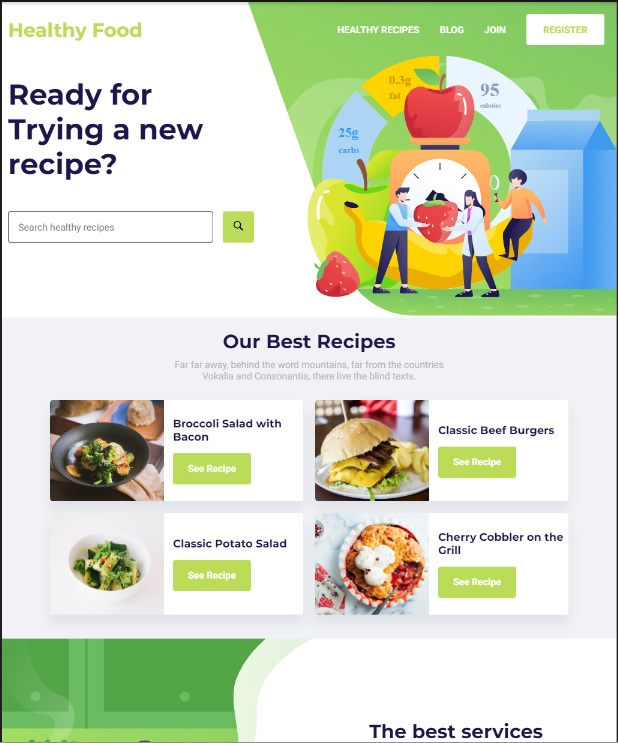
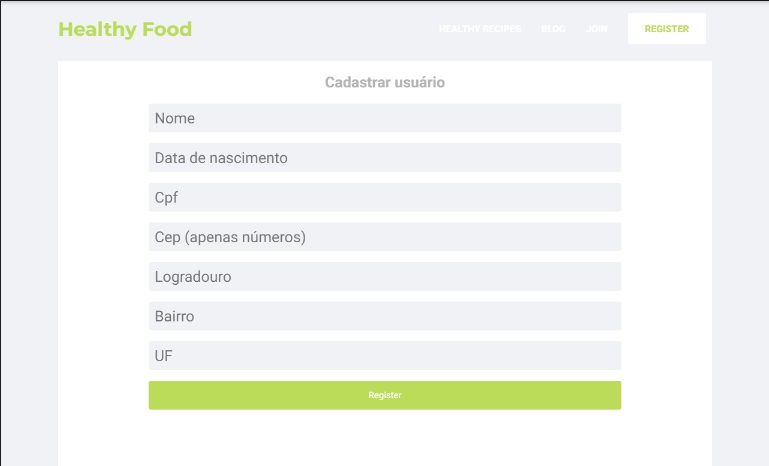

<h1>Healthy Food</h1>
<h3>Projeto desenvolvido para um teste</h3>

## Tópicos

[Sobre o Sobre o Healthy Food](#Sobre-o-Frontend-Challenge)

[Missão](#missão)

[Imagens](#imagens)

[Tecnologias](#tecnologias)

[Instalação e uso](#instalação-e-uso)

<br>

## Sobre o Healthy Food
Esse projeto e sobre um desafio de teste pra uma vaga aonde foi me passado:
Desenvolver o site que está em anexo utilizando toda a estrutura do React, o site tem que ser 100% responsivo, iremos avaliar bem a responsividade.

Criar a tela de cadastro baseada na tela inicial, o cadastro precisa receber os dados abaixo:

a. Nome

b. Data de nascimento

c. CPF

d. CEP

i. Utilizar a API dos correios para preencher os demais campos que compõe o endereço.
  Para consulta do CEP poderá utilizar API pública [ViaCEP](https://viacep.com.br/)

e. Validação dos campos

f. Armazenar os dados do formulário no local storage e Cookies

Não precisa utilizar banco de dados


<h5>Foi usado a aba Projects no repositório do GitHub para acompanhar Sobre Metodologias Ágeis</h5>
<br>

## Missão
✔️ Criar uma aplicação ReactJs
✔️ Rodar na web
✔️ Utilizar Typescript
✔️ Utilizar API dos correios
✔️ Responsivo
✔️ Subir no github
<br>


## Imagens
<p align="center">
  
</p>

<br>
<br>
<br>

<p align="center">
  
</p>

## Tecnologias

Tecnologias e ferramentas utilizadas no desenvolvimento do projeto:

- [ReactJs](https://pt-br.reactjs.org/)
- [TypeScript](https://www.typescriptlang.org/)
- [SASS](https://sass-lang.com/)
- [React Hook Form](https://www.react-hook-form.com)
- [Yup](https://github.com/jquense/yup)
- [Axios](https://github.com/axios/axios)
- [React Icons](https://github.com/react-icons/react-icons#readme)
- [Framer-Motion](https://www.framer.com/motion/)
- [React Responsivo Carousel](http://react-responsive-carousel.js.org/)
- [Prettier](https://prettier.io/)
- [Eslint](https://eslint.org/)


<br>

## Instalação e uso

```bash
# Abra um terminal e copie este repositório com o comando
git clone https://github.com/3ddybr/healthy_food.git
# ou use a opção de download.

# Entre na pasta web com
cd healthy_food

# Instale as dependências
yarn install

# Rode a aplicação
yarn start
```
<br>
